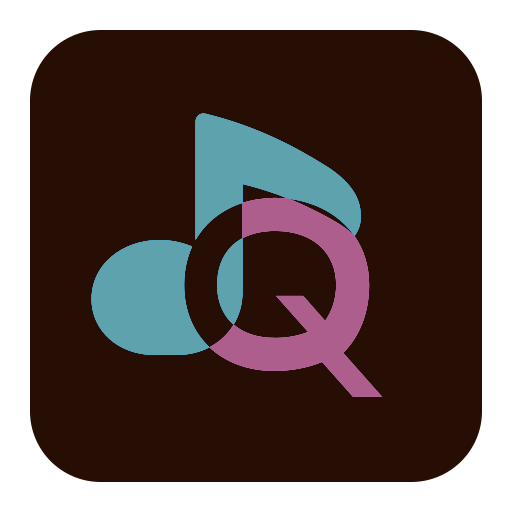
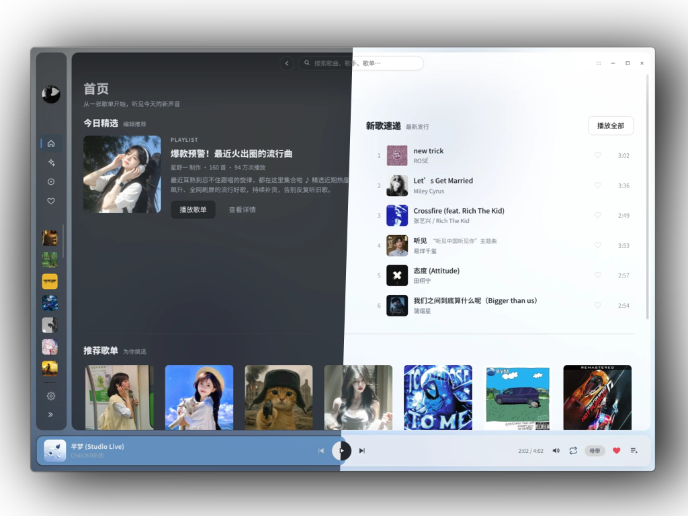

  

# Quaver Music- 又一个第三方 QQ 音乐客户端

Quaver Music，是一款 QQ 音乐的第三方客户端，其目的是为了让 Linux DE / Wayland WM 用户能够爽用，基于 Electron + Vite 实现

名字取自于八分音符，对应了音乐，“QQ” 的 Q 字母。

  

> [!CAUTION]
> 真爱音乐，尊重正版，音乐平台不易，该应用**不提供盗版 QQ 音乐服务！**
>
> 与此同时，这个软件目前全权是拷打 QWen 3.8 Flash 诞生的，按原样提供，use own ur risk！

# 契机

我一直是 QQ 音乐的用户，也用过 NCM 的第三方客户端，Spotify，Apple Music。

然而 QQ 音乐一直没有什么好用的第三方客户端，而同 TME 系的有 [MoeKoe](https://music.moekoe.cn/) ，而转机是在 [Lyrune](https://github.com/amtoaer/lyrune)，一个挺好用的 Rust Q 音第三方客户端，但可惜 Rust 太重了，而且我 Rust 是真的菜。

所以使用 Electron，对接入 NodeJS 的 API 而言也很方便，开发也很快，也可以避免我孱弱的 Rust 开发，与此同时，后端我也能玩 C++ 这一个我更熟悉的编程语言（虽然最后变成了 TypeScript + Python）。故此项目诞生，现正在 Prototype 阶段，逐步新增功能。

# 目标

跟之前的项目 Cipher Tools 一样，这个项目依旧会给每个版本加个代号，目前还是 Prototype，代号为 "Neon"，取自无畏契约角色霓虹，版本号为语义化版本号结构 v+ “x.y.z" 开发代号均出自《无畏契约》的特工 + 《绝区零》的角色，而副分支开发代号取自《鸣潮》和《崩坏：星穹铁道》角色，且副分支开发代号，在未进入正式版开发/收尾阶段，永远都是 Prototype。

x：每一个大版本均为 10 个小版本（典型情况），如遇到更改技术栈/本体出现大改情况除外
y：功能更新版本
z：修补版本号

| 版本号    | 主分支开发代号 | 副分支开发代号        | 隶属开发阶段           |
| ------ | ------- | -------------- | ---------------- |
| v0.x.x | Neon    | Prototype      | Prototype        |
| v1.0.0 | Ellen   | Chisa          | Stable           |
| v1.0.x | Ellen   | Chisa - PatchX | Stable - PatchX* |
| v1.1.0 | Ellen   | Cyrene         | Stable - FEP1*   |

> PatchX：修复包版本 
> 
> FEP：功能启用包

罗马不是一天建成的，为了防止墙被砌歪，在 Prototype 阶段，将完成以下工作

- [x] 基础 UI 建设（播放页主页）
- [x] 使用 WebAPI，完成基础的后端数据获取（换成 Python API 了）
- [x] 打包 CI

现在的基础 UI 设计使用了 Pixso，感谢万兴开发的 Pixso，我大学时期就在用的 UI/UX 设计工具（虽然当时是上课）！

在这三个完成后，将进入 Stable 阶段的开发，在此阶段，我需要完成以下工作

- [x] 代号为 `Typhoeus` 的统一后端（集合现在的 Quaver SAL，抽象部分 API 能力 + 自实现播放后端，使用 AGPLv3 协议开源，在考虑因此学习 Zig 还是重新开始 Rust 还是复习 C++ ）
- [x] MPRIS 支持（使用 `Typhoeus` 后端实现）
- [x] 使用 PythonAPI 完善后端功能（使用 `Typhoeus` 后端抽象实现）
- [ ] 清理 Bugs

并在未来的 FEP 版本中，加入呼声较高的功能，或未完成实现的功能。

# 配置

设置与登录凭证都在系统标准配置目录（Linux `~/.config/quaver-music`，Windows `%AppData%\Quaver Music`，
macOS `~/Library/Application Support/Quaver Music`）—— 换版本、重装都不丢。`quaver.conf` 是 INI，可直接手改
（程序只改对应键那一行，注释保留）。

登录凭证交给**系统密钥管理器**（KWallet / GNOME Keyring / 钥匙串 / 凭据管理器）：磁盘上只留密文
`credential.enc`，钥匙在系统密钥环里。**凭证明文不落盘** —— 拿不到密钥环时本次登录只驻内存，
关掉应用需重新扫码，没有「退回明文」这一档。
细节见 [ui/README.md](ui/README.md)。

# 构建与发布

CI（`.github/workflows/build.yml`）产出 x86_64 / aarch64 双架构 AppImage，版本号分三态：

| 触发 | 版本号 | 发布 |
| --- | --- | --- |
| 打 `v*` tag | tag 去掉 `v` | 正式 Release |
| 每夜定时（每天 18:00 UTC）/ 手动勾 `nightly` | `<package.json 版本>-<短 commit id>-nightly` | 滚动 Release `nightly`（覆盖上一次） |
| push main / PR | `package.json` 里的值 | 不发布，只出 artifact |

每夜版用滚动 tag `nightly`：老的那份（release + tag）会先删再建，仓库里始终只有一份「最新」。
产物名与「关于」页都带 commit id，下载下来就知道对应哪个提交。

版本号不能写成裸的 `<commit id>-nightly`：electron-builder 会对 `version` 做 semver 校验，
非 semver 直接构建失败，所以 commit id 只能放在 prerelease 段里。

# 协议

该项目使用 AGPLv3 及其未来版本协议协议，其使用的 API 上游使用 GPLv3 及其未来版本协议

[Python - GPLv3-or-later - l-1124/QQMusicApi](https://github.com/l-1124/QQMusicApi)  

与此同时，该项目依旧无法避免属于 QQ 音乐第三方客户端，请尊重 QQ 音乐的最终用户协议，禁止破解 QQ 音乐的曲库，本应用仅提供流媒体服务，不提供任何下载服务。
