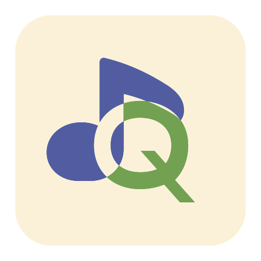
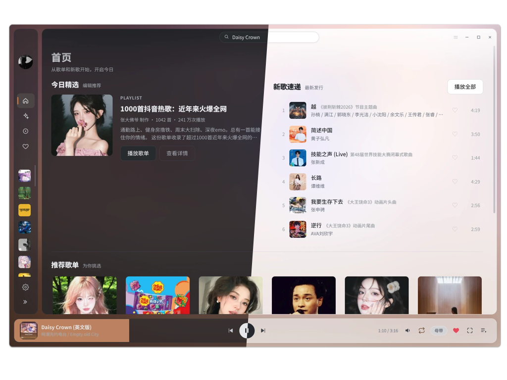
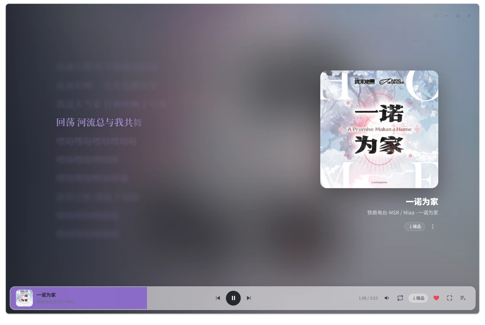
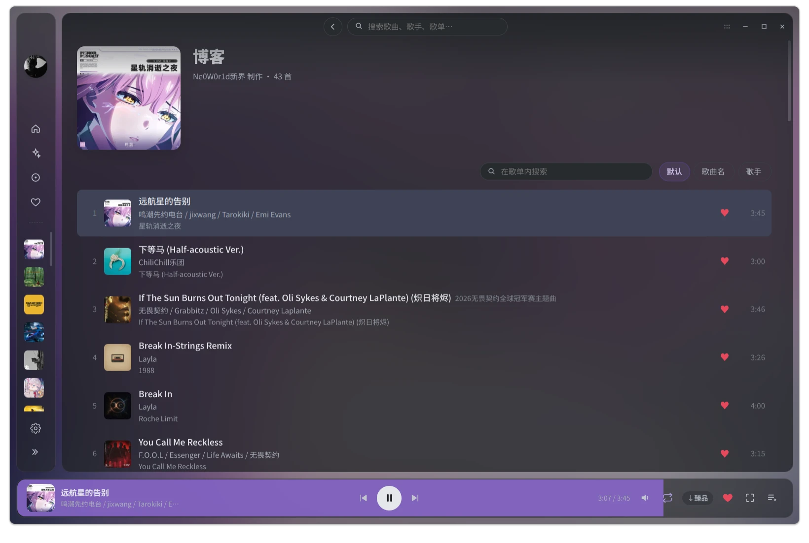

  

# Quaver Music

--- 

现代、流畅、百变的第三方 QQ 音乐客户端

---

Quaver Music，最早是为了解决 Linux 上 QQ 音乐官方客户端不好用而生。

而现在，它已然成为一个完善，现代，流畅，百变，以极致体验而生的第三方 QQ 音乐客户端。

> [!CAUTION]
> 真爱音乐，尊重正版，音乐平台不易，该应用**不提供盗版 QQ 音乐曲目服务！**
> 
> 本软件系 Vibe Coding 的产物，虽然我会尽力尝试个人维护，但不提供可用性保证

与此同时，非 WebView 版本的 Quaver Music Astra 也正在路上 -> [传送门](https://github.com/team-quaver/quaver-astra)，复用 Typhoeus-Go 后端，基于 Golang + MyGO 框架设计。

# 功能特性

- 🎉 百变：支持 Sparkle 插件，可用 Sparkle 插件支持
- 🖥 跨平台：支持 Windows（X86、ARM） / ARM macOS / Linux（X86、龙芯、ARM）
- 📚 系统集成：支持 dBus MPRIS、Windows SMTC、macOS NowPlaying 与 Logind Inhibit、Windows 电源请求、macOS 电源断言
- 📔 丰富歌词：支持 QRC 和 LRC，逐字高亮和翻译
- 🎨 自适应主题：基于封面背景 + Tint，支持深浅模式和跟随系统

# 截图

#### 深浅模式/主页

  

#### 正在播放页

  

#### 歌单

  

# 目标

跟之前的项目 Cipher Tools 一样，这个项目依旧会给每个版本加个代号，目前还是 Prototype，代号为 "Neon"，取自无畏契约角色霓虹，版本号为语义化版本号结构 v+ “x.y.z" 开发代号均出自《无畏契约》的特工 + 《绝区零》的角色，而副分支开发代号取自《鸣潮》和《崩坏：星穹铁道》角色，且副分支开发代号，在未进入正式版开发/收尾阶段，永远都是 Prototype。

x：每一个大版本均为 10 个小版本（典型情况），如遇到更改技术栈/本体出现大改情况除外
y：功能更新版本
z：修补版本号

| 版本号    | 主分支开发代号 | 副分支开发代号 | 隶属开发阶段   |
| ------ | ------- | -------------- | ---------------- |
| v0.x.x | Neon    | Prototype      | Prototype        |
| v1.0.0 | Ellen   | Chisa          | Stable           |
| v1.0.x | Ellen   | Chisa          | Stable - PatchX* |
| v1.1.0 | Ellen   | Cyrene         | Stable - FEP1*   |
| v1.2.0 | Ellen   | Phoebe         | Stable - FEP2*   |
| v1.2.0 | Ellen   | Evanescia      | Stable - FEP3*   |
| v1.4.0 | Ellen   | Aemeath        | Stable - FEP4*   |

> PatchX：修复包版本 
> 
> FEP：功能包

# 配置

设置与登录凭证都在系统标准配置目录（Linux `~/.config/quaver-music`，Windows `%AppData%\Quaver Music`，
macOS `~/Library/Application Support/Quaver Music`）—— 换版本、重装都不丢。`quaver.conf` 是 INI，可直接手改
（程序只改对应键那一行，注释保留）。

登录凭证交给**系统密钥管理器**（KWallet / GNOME Keyring / 钥匙串 / 凭据管理器）：磁盘上只留密文
`credential.enc`，钥匙在系统密钥环里。**凭证明文不落盘** —— 拿不到密钥环时本次登录只驻内存，
关掉应用需重新扫码，没有「退回明文」这一档。
细节见 [ui/README.md](ui/README.md)。

# 构建与发布

CI（`.github/workflows/build.yml`）产出 x86_64 / aarch64 双架构 AppImage，版本号分三态：

| 触发 | 版本号 | 发布 |
| --- | --- | --- |
| 打 `v*` tag | tag 去掉 `v` | Release **草稿**（人工核对后手动 Publish） |
| 每夜定时（每天 18:00 UTC）/ 手动勾 `nightly` | `<package.json 版本>-<短 commit id>-nightly` | 滚动 Release `nightly`（覆盖上一次） |
| push main / PR | `package.json` 里的值 | 不发布，只出 artifact |

每夜版用滚动 tag `nightly`：老的那份（release + tag）会先删再建，仓库里始终只有一份「最新」。
产物名与「关于」页都带 commit id，下载下来就知道对应哪个提交。

版本号不能写成裸的 `<commit id>-nightly`：electron-builder 会对 `version` 做 semver 校验，
非 semver 直接构建失败，所以 commit id 只能放在 prerelease 段里。

# 应用内更新

应用自己检查 GitHub Releases 并就地更新，入口在「设置 → 通用 → 应用更新」：

- **自动检查**（默认开）：启动后延迟检查一次，发现新版本**先弹窗展示更新日志**，点确认才开始下载
  安装，绝不静默更新。关掉后仍可手动「检查更新」。
- **渠道 Stable / Nightly 可以互相切换**。换渠道不按「谁版本号更大」判 —— 选完会自动检查一次，
  即使版本号相同也会提示换上对应渠道的构建（Nightly 构建切回 Stable 时版本号可能回退，弹窗会写明
  这一点）。构建属于哪个渠道只看版本串里的短 commit id，不额外记录状态，所以换版本、重装都不会失配。
- 找不到当前平台/架构的安装包时，弹窗只给「打开发布页」的出口。

安装收尾按平台：**AppImage** 原位替换（文件名保持不变，桌面项与 Gear Lever/AppManager 的记录继续有效；
被 Gear Lever / AppManager 接管时也可以把更新交给它们）｜ **Windows** 拉起 NSIS 静默安装并退出应用 ｜
**macOS dmg / Linux deb** 交给系统打开，剩下的手动完成。

# 协议

由于项目传染，该项目使用 AGPLv3 协议

与此同时，该项目依旧无法避免属于 QQ 音乐第三方客户端，请尊重 QQ 音乐的最终用户协议，禁止破解 QQ 音乐的曲库，本应用仅提供流媒体服务，不提供任何下载服务。
